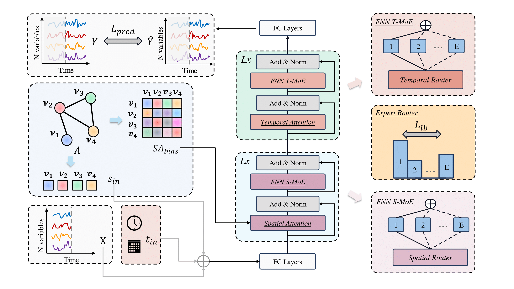

# Navigating Spatio-Temporal Heterogeneity: A Graph Transformer Approach for Traffic Forecasting

| **[Paper]()** | **[Datasets]()** |

Here is the repository containing our code implementation of Spatio-Temporal Graph Transformer (STGormer).


## Environment Setup

Install the requirements with pip:
```bash
pip install -r requirements.txt
```

## Datasets

The datasets range from `{NYCBike1, NYCBike2, NYCTaxi, METALA, PEMSBAY}`. Please download the **[Dataset]()** into the folder `data/`.
```
cd data/ && unzip Datesets.zip
```
And you need to change the format of `{METALA, PEMSBAY}` by following the instructions in `data/pmes2nyc.ipynb`. Each dataset is composed of 4 files, namely `train.npz`, `val.npz`, `test.npz`, and `adj_mx.npz`.
```
|----{Dataset}\
|    |----train.npz    # training data
|    |----test.npz     # test data
|    |----val.npz      # validation data
|    |----adj_mx.npz   # predefined graph structure
```

## Model training
```bash
python main.py -g={GPU-ID} /
-d={datasets，NYCBike1/NYCBike2/NYCTaxi/METRLA/PEMSBAY} /
-s={save_path}
```

## Citation
```
```